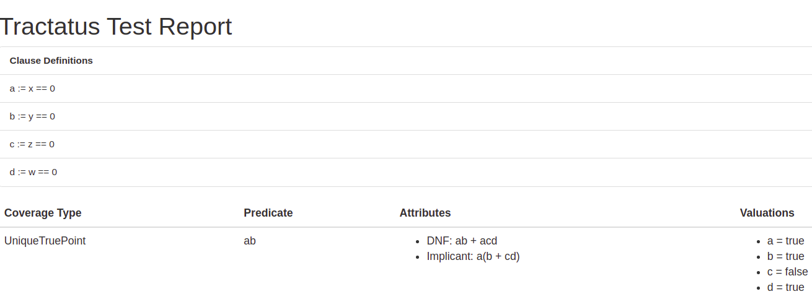

# Introduction
Tractatus is a library for __Logic Based Testing__ documentation and reporting. 

> About the name!
> The project is named by [Mohammad Reza](https://github.com/mryf323) when he created it. [Tractatus](https://en.wikipedia.org/wiki/Tractatus_Logico-Philosophicus) is one of the most complex philosophical books ever written!


# Documentation
If you want to use this library you just need to know these annotations. 

* [@ClauseCoverage](https://kiarashazarnia.github.io/tractatus/com/github/mryf323/tractatus/ClauseCoverage.html)
* [@UniqueTruePoint](https://kiarashazarnia.github.io/tractatus/com/github/mryf323/tractatus/UniqueTruePoint.html)
* [@NearFalsePoint](https://kiarashazarnia.github.io/tractatus/com/github/mryf323/tractatus/NearFalsePoint.html)
* [@CACC (Correlated Active Clause Coverage)](https://kiarashazarnia.github.io/tractatus/com/github/mryf323/tractatus/CACC.html)
* [@Valuation](https://kiarashazarnia.github.io/tractatus/com/github/mryf323/tractatus/Valuation.html)
* [@ClauseDefinition](https://kiarashazarnia.github.io/tractatus/com/github/mryf323/tractatus/ClauseDefinition.html)

### Sample Usage
Easily document your test cases like below. For more info see the test sample in the repo and also refer to the [documents](https://kiarashazarnia.github.io/tractatus).
```
    @UniqueTruePoint(
            predicate = "ab",
            dnf = "ab + acd",
            implicant = "a(b + cd)",
            valuations = {
                    @Valuation(clause = 'a', valuation = true),
                    @Valuation(clause = 'b', valuation = true),
                    @Valuation(clause = 'c', valuation = false),
                    @Valuation(clause = 'd', valuation = true)
            }
    )
    @Test
    public void smpleTestForOneAnnotation() {
        assertTrue(predicate(0,0,1,0));
    }
```
> The technical terminology is mainly from logic based testing literature used in the book [Introduction to Software Testing](https://www.goodreads.com/en/book/show/2923665-introduction-to-software-testing).


### Reporting
Simply add the extension to your test classes and see the reports in the `tractatus` directory in your project root.
Currently, reporting Junit 5 extension is experimental so feel free to report any issues. 
```
@ExtendWith(ReportingExtension.class)
class YourTestClass  {
```
The report is a simple document like this:



## Quick Start
### Maven
Currently, the Maven Central does not have the latest version. But you can easily use Github Maven Repository to access the latest version.
As you know, the library could also be fetched by the other build tools like Ant, SBT, Gradle, and so on with the proper syntax.
```
<dependencies>
    <!-- other dependencies... -->
    
    <dependency>
      <groupId>com.github.mryf323</groupId>
      <artifactId>tractatus</artifactId>
      <version>LATEST</version>
    </dependency>
</dependencies>

<repositories>
    <!-- other repositories... -->
    <repository>
        <id>central</id>
        <url>https://repo1.maven.org/maven2</url>
    </repository>

    <repository>
        <id>github-kiarash</id>
        <url>https://maven.pkg.github.com/kiarashazarnia/*</url>
        <snapshots>
            <enabled>true</enabled>
        </snapshots>
    </repository>
</repositories>
```


## Contribution
The project is open-source under the MIT License, so feel free to fork it and make a pull request if you have any ideas.
Although the deployment process is automated thanks to [Github Actions](https://github.com/kiarashazarnia/tractatus/actions), the merging action is manual, so do not hesitate to deploy it on your own fork.
The Github Packages service has a fairly easy mechanism despite the Maven Central's.
